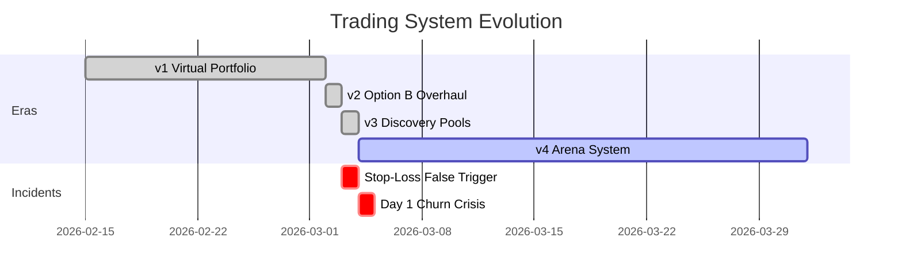

# 📚 Semaphore Trading System — Change Library & Decision Record

> **Purpose**: A comprehensive, chronological record of every significant system change, the reasoning behind it, the outcome, and the lessons learned. This document must be consulted before any future redesign.
>
> **Last updated**: 4 March 2026, 16:50 UTC

---

## Table of Contents

1. [System Timeline](#system-timeline)
2. [Era 1: Virtual Portfolio — Original Design](#era-1)
3. [Era 2: Option B Overhaul](#era-2)
4. [Era 3: Discovery Pools](#era-3)
5. [Era 4: Arena System (4-Pool Competition)](#era-4)
6. [Era 4.1: Anti-Churn Emergency Fixes](#era-41)
7. [Persistent Design Flaws Tracker](#persistent-flaws)
8. [Key Principles (Distilled from All Failures)](#key-principles)
9. [Performance Baselines](#performance-baselines)

---

## System Timeline

---

## Era 1: Virtual Portfolio — Original Design (Feb 2026)

### Architecture
- Single virtual portfolio with real Revolut trade execution
- AI scores tokens 0-100 using Gemini, rules engine converts scores to trades
- TACTICAL risk profile with strategy library (e.g., "Blood in the Streets" for extreme fear)
- 5-minute cron cycle, 16 max open positions, $30 min order

### What Went Wrong
| Problem | Root Cause | Impact |
|---------|-----------|--------|
| 18% win rate | Buy threshold too low (effective 64 after strategy adjustments) | Persistent losses |
| $21-$36 micro-positions | Firestore overrides reduced min order from $150 to $30 | Spread ate all profit |
| 0% cash reserve | User override from 10% to 0% | 100% market exposure during crashes |
| Over-diversification | 12-16 positions, none large enough to matter | "Dust portfolio" |
| Strategy layer bleeding | "Blood in the Streets" lowered thresholds -4 AND shrunk sizes x0.7 | Scattergun approach in bad markets |
| Rapid churn via laggard swaps | Swap threshold at score 65 (below buy threshold 72) | 1% round-trip spread cost on marginal improvements |

### Key Data Points
- Portfolio value: ~$628 (from $744 invested, -15.6% all-time)
- Realised P&L: +$18.45 (closed trades were actually profitable)
- Unrealised P&L: -$134 (open underwater positions from crash)
- Expectancy per trade: +$0.17 (barely positive)
- Wins: 4 / Losses: 18

### Documents
- [Profit-Above-All Mandate](file:///Users/chris/.gemini/antigravity/knowledge/trading_performance_strategy_reporting/artifacts/strategic_directives/profit_above_all_mandate.md)
- [TACTICAL Profile Audit](file:///Users/chris/.gemini/antigravity/knowledge/trading_performance_strategy_reporting/artifacts/tactical_profile_audit_analysis.md)
- [Trading Efficiency Research](file:///Users/chris/.gemini/antigravity/knowledge/trading_performance_strategy_reporting/artifacts/trading_efficiency_research_findings.md)
- [Portfolio Trajectory Analysis](file:///Users/chris/.gemini/antigravity/knowledge/trading_performance_strategy_reporting/artifacts/portfolio_trajectory_analysis.md)

### Lessons Learned
1. **Firestore overrides silently broke the system** — User-level config values overrode sensible defaults without any guardrails or warnings.
2. **Strategy layer multipliers compound** — A 0.7x strategy multiplier times 0.5x entry-type multiplier = 0.35x actual position, which nobody intended.
3. **Win rate matters more than risk-reward at small scale** — With $30 positions, even a 23:1 risk-reward can't overcome 82% loss rate + spread costs.
4. **Cash reserve of 0% is never correct** — Full market exposure means the portfolio is just a leveraged index fund.

---

## Era 2: Option B Overhaul (2 March 2026)

### What Changed
| Change | Before | After | Rationale |
|--------|--------|-------|-----------|
| Min order amount | $30 | $150 | Stop micro-trades eaten by spread |
| Default buy amount | $50 | $150 | Meaningful position sizes |
| Max allocation/asset | $120 | $400 | Let winners run |
| Cash reserve | 0% | 10% | Defensive buffer |
| Min market cap | $10M | $100M | Remove volatile micro-caps |
| Max open positions | 16 | 6 | Force concentration |
| Momentum gate | -2% | 0% | Only buy positive momentum |
| Laggard swap threshold | Score 65 | Score 72 | No marginal swaps |
| "Blood in Streets" threshold adjust | -4 | +2 | Be MORE selective in crashes |
| "Blood in Streets" size multiplier | 0.7x | 1.0x | Full-size or don't buy |

### Outcome
- **Immediate**: Portfolio was liquidated and reset as part of the overhaul
- **Next day**: Emergency stop-loss triggered (false positive, see Era 2.5)

### What Went Right
- Configuration reset was necessary and correct
- Concentrated positioning (6 max) was the right direction
- Tighter momentum gate was correct

### What Went Wrong
- **Complete portfolio reset** destroyed all existing positions and history
- **Stop-loss false trigger** the next day caused another full liquidation

### Documents
- [Option B Implementation Report](file:///Users/chris/.gemini/antigravity/knowledge/trading_performance_strategy_reporting/artifacts/implementation/trading_strategy_overhaul_b.md)
- [Optimization Options A/B/C](file:///Users/chris/.gemini/antigravity/knowledge/trading_performance_strategy_reporting/artifacts/strategic_directives/profitability_optimization_options.md)

### Lessons Learned
1. **Never do a "big bang" reset** — Liquidating everything and starting fresh destroys continuity and creates edge cases (stop-loss false triggers from synthetic snapshots).
2. **Changes should be incremental** — Changing 10 parameters at once makes it impossible to know which change helped or hurt.

---

### Era 2.5: Stop-Loss False Trigger Incident (3 March 2026)

### What Happened
The 25% portfolio drawdown circuit breaker triggered, liquidating all holdings and pausing automation. The trigger was likely a combination of:
1. Short portfolio history (only 18h since reset)
2. Stale high-water mark from initial trades
3. Market downturn creating legitimate drawdown from intra-day peak

### Root Cause
The `checkAndEnforceStopLoss()` function calculates drawdown from the **peak** of all snapshots in the last 24h. After a reset, the synthetic "24h ago" snapshot plus any initial trades created a peak that the portfolio then fell below during normal market movement.

### Impact
- All positions sold at market
- Automation disabled
- Required manual resume

### Documents
- [Stop-Loss Audit](file:///Users/chris/.gemini/antigravity/brain/d6186ec6-f557-4a58-95e8-1dd1da0cf1b9/stop_loss_audit.md)

### Lessons Learned
1. **Portfolio resets create dangerous edge cases** — The stop-loss system doesn't have a "newly reset" mode with relaxed thresholds.
2. **There should be a cooldown period after major changes** — No stop-loss checks for the first 48h after a reset.

---

## Era 3: Discovery Pools (3 March 2026)

### Concept
Two isolated pools ($100 each) with AI-managed strategies, designed as an A/B testing framework. Each pool had 2 tokens, AI-controlled parameters, and a 25% daily loss cap. This was the first attempt at true strategy experimentation.

### What Changed
- New `discoveryPoolService.ts` with independent trade execution
- Per-pool strategies fully AI-controlled
- 24h token rotation cycle
- Comparison dashboard for pool-vs-pool performance

### What Went Wrong
- **Never got to run properly** — Stop-loss incident on 3 March disrupted testing
- **Design was superseded** within 24 hours by the Arena system (4 pools instead of 2)
- **Real Revolut trades** meant experiments cost real money even when failing

### Lessons Learned
1. **The concept was sound** — Isolated pools with different strategies is the right testing framework.
2. **2 pools isn't enough differentiation** — More pools = more data points for comparison.
3. **Budget of $100/pool was too small** — With 2 tokens and small trades, spread costs dominated.

### Documents
- [Discovery Pools Design](file:///Users/chris/.gemini/antigravity/brain/dd3341c4-abdd-4d9f-ae53-9f58a1105da9/discovery_pools_design.md)

---

## Era 4: Arena System — 4-Pool Competition (4 March 2026)

### Concept
28-day competition with 4 AI-managed pools, each with $150 budget, 2 locked tokens, and full strategy autonomy. AI selects tokens at start, strategies evolve via dynamic reviews.

### Architecture Changes
| Component | Design |
|-----------|--------|
| Pools | 4 pools x 2 tokens x $150 = $600 total |
| Token locking | Tokens locked for 28 days (no rotation) |
| Strategy reviews | Dynamic triggers: weekly boundary, 5+ trades, or 3%+ P&L drop |
| Cron | Every 3 minutes |
| Real trading | All trades execute on Revolut |
| AI scoring | Per-token analysis with real technicals (RSI, SMA, MACD, order book) |
| Take-profit | Configurable per pool (initially 3-8%) |
| Trailing stop | Configurable per pool |
| Min hold time | 60 minutes (hardcoded) |

### Pool Assignments (AI-Selected)
| Pool | Strategy | Tokens | Initial Parameters |
|------|----------|--------|-------------------|
| Momentum Mavericks | Momentum riding | ICP, RENDER | Buy>=75, Exit<55, TP=3% |
| Deep Divers | Dip hunting | AAVE, LINK | Buy>=65, Exit<50, TP=3% |
| Steady Sailers | Patient accumulation | DOT, ADA | Buy>=70, Exit<50, TP=3% |
| Agile Arbitrageurs | Aggressive swinging | FLOKI, SHIB | Buy>=80, Exit<70, TP=1.5% |

### Day 1 Results (4 March 2026)

> [!CAUTION]
> **BTC was up 6.64% on this day. A simple buy-and-hold of any token would have been profitable.**

| Pool | P&L | Trades | W/L | Diagnosis |
|------|------|--------|-----|-----------|
| Momentum Mavericks | -$1.14 (-0.76%) | 5 | 0W/2L | Bought and sold too fast |
| Deep Divers | -$0.21 (-0.14%) | 14 | 0W/6L | 6 AAVE round-trips in 6 hours |
| Steady Sailers | -$0.96 (-0.64%) | 27 | 2W/11L | 27 trades — not "steady" |
| Agile Arbitrageurs | -$0.45 (-0.30%) | 4 | 0W/2L | Micro-losses on meme coins |
| **TOTAL** | **-$2.76 (-0.46%)** | **51** | **2W/21L** | |

### What Went Wrong

1. **3-minute cron cycle + LLM noise = churning**
   - AI scores oscillate plus or minus 10-15 points between identical calls
   - DOT was buy-sell-buy-sell 7 times in 66 minutes
   - Each round-trip loses $0.19-$1.33 to Revolut spread

2. **Strategy review made things WORSE**
   - All 4 pools triggered dynamic review after about 3 hours
   - Pool 2 narrowed buy/exit gap from 15 to 5 points (catastrophic)
   - Pool 4 set antiWashHours to 0 and takeProfitTarget to 1.5%
   - The review AI saw "0 wins, losses" but couldn't diagnose WHY

3. **Strategy review AI is blind to execution metrics**
   - Doesn't receive: hold durations, spread costs, score variance, churn rate
   - Doesn't receive: buy-and-hold comparison
   - Can't see that its own scoring is oscillating
   - Can only adjust thresholds, not hold times or evaluation frequency

4. **One scoring prompt for all strategies**
   - The `analyzeCryptoForPool()` prompt biases toward frequent trading
   - Contains: "You do NOT make money by holding forever"
   - Contains: "Every extra hour you hold a losing position is wasted capital"
   - This prompt is the same for the "Patient Accumulator" as for the "Aggressive Swinger"
   - The "patient" pool made 27 trades in 6 hours

### Documents
- [Day 1 Diagnosis](file:///Users/chris/.gemini/antigravity/brain/359d82f2-77cb-46e3-b422-c1eb6fe0fdf4/arena_day1_diagnosis.md)
- [Self-Improving Agent Analysis](file:///Users/chris/.gemini/antigravity/brain/359d82f2-77cb-46e3-b422-c1eb6fe0fdf4/self_improving_agent_analysis.md)
- [Earlier Trading Loss Audit](file:///Users/chris/.gemini/antigravity/brain/21b14d12-4fe9-4ff0-86a7-779e9cb2316a/arena_trading_audit.md)

### Lessons Learned
1. **LLM scoring has inherent noise** — The same token with the same data gets different scores each call. This is a fundamental property of generative AI, not a bug.
2. **High-frequency evaluation + noisy scoring = guaranteed losses** — 3-minute cycles convert LLM noise into trades.
3. **Strategy review needs execution data** — Without seeing hold times, spread costs, and score variance, the review AI can't diagnose systemic issues.
4. **The scoring prompt contradicts "patient" strategies** — Telling the AI "every hour you hold is wasted capital" while the pool's strategy is "patient accumulation" is a direct conflict.
5. **The system is a rules engine, not a self-improving agent** — The AI generates numbers; hardcoded if/else logic converts them into trades. The strategy review can adjust thresholds but can't change execution mechanics.

---

## Era 4.1: Anti-Churn Emergency Fixes (4 March 2026, 15:48 UTC)

### What Changed

| Fix | Before | After | Rationale |
|-----|--------|-------|-----------|
| Min hold time | 60 min | **240 min (4h)** | Stop 3-minute buy-sell churn |
| AI exit hysteresis | Score < exitThreshold | Score < exitThreshold **- 10** | Prevent oscillation sells |
| Buy confidence buffer | Score >= buyThreshold | Score >= buyThreshold **+ 5** | Prevent borderline entries |
| Position size multiplier | 0.5 / 0.75 / 1.0 | **0.7 / 0.85 / 1.0** | Larger positions absorb spread |
| Strategy guardrails | None | **Min 25-pt buy/exit gap, min 4h antiWash, min 3% TP** | Prevent review AI from creating narrow gaps |

### Firestore Strategy Migration
| Pool | exitThreshold Before | exitThreshold After | antiWashHours Before | After |
|------|---------------------|--------------------|--------------------|-------|
| Pool 1 | 45 | 45 (already OK, gap=25) | 4 | 4 |
| Pool 2 | 55 | **35** (gap was 5, fixed to 25) | 2 | **4** |
| Pool 3 | 50 | **35** (gap was 10, fixed to 25) | 24 | 24 |
| Pool 4 | 60 | **50** (gap was 15, fixed to 25) | 0 | **4** |

### Known Problems with This Fix

> [!WARNING]
> These are **blanket rules** applied uniformly to all pools. This contradicts the arena's purpose of testing different strategies.

- Pool 4 (Agile Arbitrageurs) was designed as high-frequency. The 4-hour hold destroys this.
- The +5 buy buffer and -10 exit buffer are global, not per-pool.
- The 0.7 minimum size multiplier applies equally to all tokens regardless of their volatility or spread characteristics.

### Lessons Learned
1. **Emergency fixes tend to be blanket rules** — Under pressure to stop losses, we applied uniform constraints that killed strategic differentiation.

---

## Era 5: Autonomous Agent Architecture (4 March 2026, 16:50 UTC)

### What Changed — 5 Architectural Upgrades

| Change | Description | Impact |
|--------|-------------|--------|
| **Per-pool execution parameters** | 6 new AI-controllable fields in PoolStrategy: `minHoldMinutes`, `evaluationCooldownMinutes`, `buyConfidenceBuffer`, `exitHysteresis`, `positionSizeMultiplier`, `strategyPersonality` | Each pool can now have genuinely different trading behaviour |
| **Score memory** | `scoreHistory` and `lastEvaluatedAt` added to ArenaPool. Last 10 scores per token persisted across cron cycles | AI can see its own oscillation patterns |
| **Smoothed scoring** | Trade decisions now use average of last 3 scores, not single raw score | Eliminates LLM noise-driven trades |
| **Strategy-aware personality prompts** | Scoring prompt adapts based on PATIENT/MODERATE/AGGRESSIVE personality | 'Steady Sailers' no longer told 'every hour held is wasted capital' |
| **Execution metrics in strategy review** | Review AI now receives: avg hold duration, churn rate, score variance, spread costs, buy-and-hold comparison | AI can diagnose AND fix execution problems |

### Per-Pool Initial Settings (Firestore Migration)
| Pool | Personality | Hold Time | Eval Cooldown | Buy Buffer | Exit Hysteresis | Size Mult |
|------|------------|-----------|---------------|------------|-----------------|----------|
| Momentum Mavericks | MODERATE | 120min | 15min | 5 | 10 | 0.80 |
| Deep Divers | PATIENT | 180min | 30min | 5 | 12 | 0.85 |
| Steady Sailers | PATIENT | 240min | 30min | 7 | 15 | 0.90 |
| Agile Arbitrageurs | AGGRESSIVE | 60min | 10min | 3 | 8 | 0.75 |

### Key Design Decision: Guardrails as Bounds, Not Values
The new parameters have bounded ranges (e.g., minHoldMinutes: 30-480) that the AI must stay within, but within those bounds the AI has full autonomy. This is the "guardrails not overrides" principle in action.

### What This Fixes
- Pool 4 can now trade with 60min holds (its intended aggressive design), not forced into 240min
- Score smoothing eliminates the DOT buy-sell-buy-sell-buy-sell pattern from Day 1 (7 round-trips in 66 minutes)
- Strategy review can now see "your avg hold was 12 minutes and you had 5 quick round-trips" and respond appropriately
- The "Steady Sailers" prompt now says "prefer holding winners" instead of "every hour held is wasted capital"

### Documents
- [Self-Improving Agent Analysis](file:///Users/chris/.gemini/antigravity/brain/359d82f2-77cb-46e3-b422-c1eb6fe0fdf4/self_improving_agent_analysis.md)

### Lessons Learned
1. **The fix for 'blanket rules' is per-pool parameters, not removing guardrails** — Each pool now has its own execution parameters within safe bounds.
2. **Score smoothing is the correct solution to LLM noise** — Averaging 3 scores is mathematically sound and simple.
3. **The AI must see execution metrics to optimise execution** — This was the fundamental missing piece.
2. **Per-pool configurable execution parameters are needed** — Hold time, hysteresis, and size multipliers should be in `PoolStrategy`, not hardcoded constants.
3. **Guardrails on AI strategy changes are necessary** — Without them, the review AI will set antiWashHours=0 and buy/exit gaps of 5 points, creating the exact problems we're trying to fix.

---

## Persistent Design Flaws Tracker

These are unresolved systemic issues that keep surfacing across eras:

| # | Flaw | First Seen | Still Open? | Eras Affected |
|---|------|-----------|-------------|---------------|
| 1 | **LLM scoring noise (plus or minus 10-15 points)** | v1 | Yes | All |
| 2 | **Revolut spread costs not modelled** | v1 | Yes | All |
| 3 | **No score memory between calls** | v1 | ✅ Fixed in v5 | All (fixed v5: scoreHistory + smoothing) |
| 4 | **Scoring prompt conflates all strategies** | v4 | ✅ Fixed in v5 | v4, v4.1 (fixed v5: strategyPersonality) |
| 5 | **Hold time, evaluation frequency are global constants** | v4 | ✅ Fixed in v5 | v4, v4.1 (fixed v5: per-pool params) |
| 6 | **Strategy review blind to execution quality** | v4 | ✅ Fixed in v5 | v4, v4.1 (fixed v5: execution metrics) |
| 7 | **No buy-and-hold benchmark comparison** | v1 | ✅ Fixed in v5 | All (fixed v5: in strategy review) |
| 8 | **Emergency fixes override per-pool strategy** | v4.1 | ✅ Fixed in v5 | v4.1 (fixed v5: per-pool execution params) |
| 9 | **Firestore overrides can silently break system** | v1 | Partial | v1 (fixed in v2, reappeared in v4 via AI review) |
| 10 | **Portfolio resets create stop-loss edge cases** | v2 | Partial | v2 |

---

## Key Principles (Distilled from All Failures)

These principles should guide any future redesign:

### On Trading Mechanics
1. **Position size must exceed 2x the round-trip spread cost** to have any chance of profit. For Revolut (about 1% spread), minimum position is approximately $100.
2. **Evaluation frequency must match hold expectation.** If you expect to hold for 4+ hours, evaluating every 3 minutes just generates noise-driven exits.
3. **LLM scores are inherently noisy.** Any system that converts a single LLM score into a trade decision will churn. Use score smoothing (average of last N) or confidence bands.
4. **Buy-and-hold is the baseline.** If the system can't beat simply buying at Day 1 and holding for 28 days, the trading logic is destroying value.

### On AI Autonomy
5. **AI must control what matters.** If hold time, evaluation frequency, and position sizing are hardcoded, the AI is not autonomous — it's adjusting knobs on a fixed machine.
6. **Strategy review needs execution data.** Win/loss counts are insufficient. The review AI needs: avg hold duration, spread cost, score variance, churn rate, and a buy-and-hold comparison.
7. **Per-pool strategies require per-pool execution parameters.** A "patient accumulator" and an "aggressive swinger" cannot share the same hold time, hysteresis, and sizing logic.
8. **Guardrails are not overrides.** Guardrails prevent catastrophic mistakes (e.g., 0h antiWash, 5-point buy/exit gap). They should not prevent strategic differentiation (e.g., different hold times, different TP targets).

### On System Design
9. **Changes must be incremental and measurable.** Never change 10 parameters at once. Change one, measure for 48h, then change the next.
10. **Every "fix" should be checked for unintended consequences.** "Increase hold time to 240 min" fixes churning but kills Pool 4's high-frequency design.
11. **Maintain a comparison benchmark.** At minimum, track what buy-and-hold of each token pair would have returned over the same period. This is the "do nothing" baseline.
12. **Never lose the history.** This document exists because we keep solving the same problems in different ways.

---

## Performance Baselines

### Market Context — 4 March 2026
| Asset | 24h Change |
|-------|-----------|
| BTC | +6.64% |
| ETH | ~+3-4% |
| Broad crypto market | Strong rally, Extreme Fear to Fear transition |

### Arena Day 1 vs Buy-and-Hold
| Pool | Arena P&L | Buy-and-Hold Est. | Delta |
|------|-----------|-------------------|-------|
| ICP + RENDER | -0.76% | +2-3% | **System cost: ~3-4%** |
| AAVE + LINK | -0.14% | +2-4% | **System cost: ~2-4%** |
| DOT + ADA | -0.64% | +1-2% | **System cost: ~2-3%** |
| FLOKI + SHIB | -0.30% | +3-5% | **System cost: ~3-5%** |

> [!IMPORTANT]
> On a strong rally day, the trading system **underperformed buy-and-hold by 2-5% per pool**. The trading logic actively destroyed value through churning.

### Historical Portfolio Metrics (Pre-Arena)
| Metric | Value | Date |
|--------|-------|------|
| Starting capital | $743.64 | Feb 2026 |
| Portfolio value at Option B reset | ~$628 | 2 Mar 2026 |
| All-time P&L | -$115.71 (-15.6%) | 2 Mar 2026 |
| Win rate | 18.2% (4W/18L) | 2 Mar 2026 |
| Expectancy per trade | +$0.17 | 2 Mar 2026 |

---

## How to Use This Document

1. **Before any redesign**: Read the [Key Principles](#key-principles) and [Persistent Flaws](#persistent-flaws) sections.
2. **Before changing a parameter**: Check all historical eras for whether that parameter has been changed before and what happened.
3. **After any change**: Add a new era/section documenting what changed, why, and tag it with a date.
4. **After 48h of operation**: Record the performance data in [Performance Baselines](#performance-baselines).
5. **After identifying a flaw**: Add it to the [Persistent Design Flaws Tracker](#persistent-flaws) with the era that first identified it.
